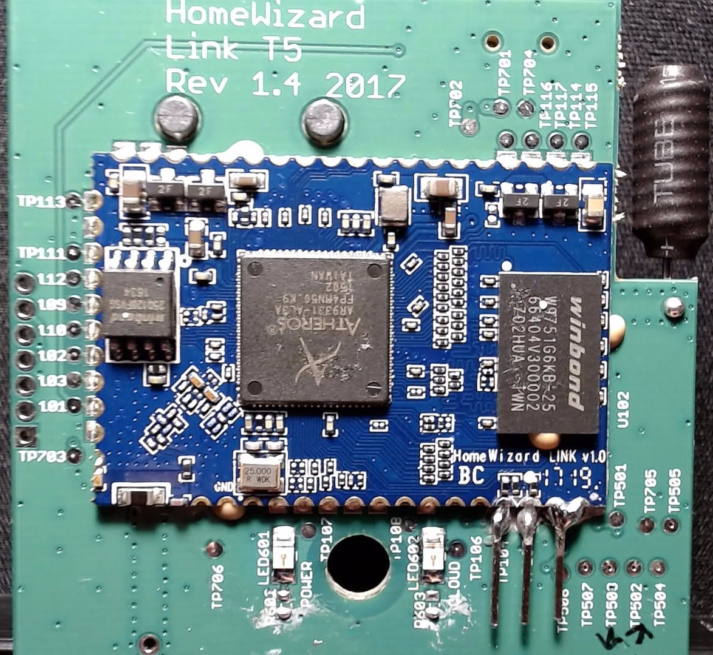
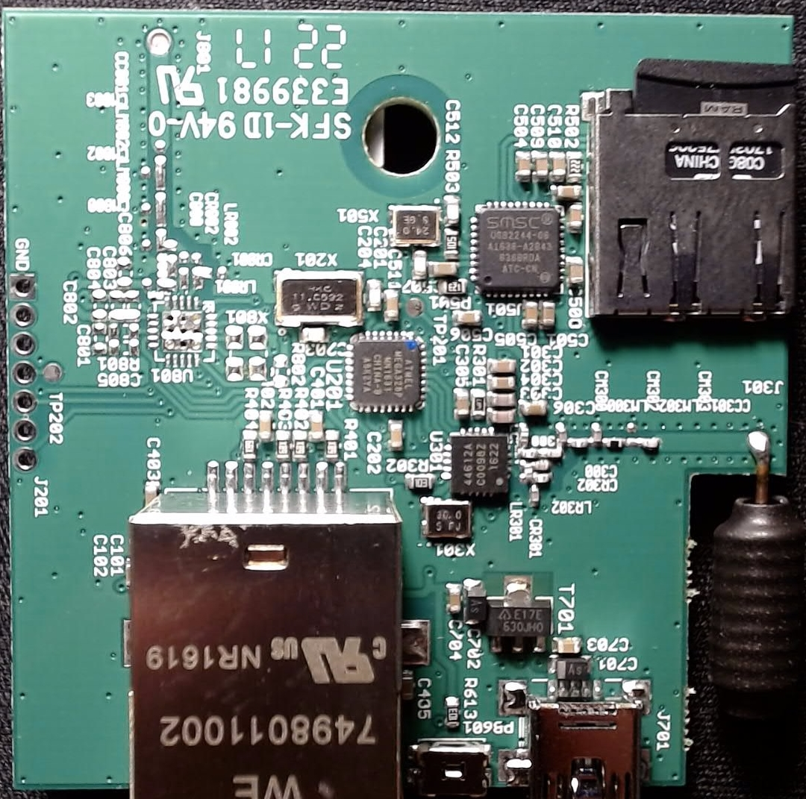

# What?
HomeAssistant integration of a Smartwares/Homewizard Link sensor gateway.
A number of sensor types are currently implemented, while further devices could be supported with the appropriate changes.
 
# Why?
By design, the sensor gateways works exclusively with the official [Android](https://play.google.com/store/apps/details?id=nl.homewizard.android.hwlink) or [Iphone](https://apps.apple.com/nl/app/homewizard-link/id1295605529) app.  
As such, no documentation regarding third-party integration is readily available - the information contained in this repo is obtained via reverse-engineering efforts.  
The dependency on the phone app is still present for pairing all the sensors and actuators - only data sampling of already-paired devices is currently supported by this repo.

# How?

## 1. Configure the sensor gateway
- Follow the official instructions on [installing, configuring, and pairing all available devices](https://link.homewizard.net/en/support/solutions/articles/19000087559-install-your-homewizard-link).  
- Take note to give each newly paired device a descriptive name, as it will be used in the next steps.  

## 2. Determine communication protocol
As a gateway, the device communicates to the Internet via a wired network connection, and links to all pairable devices via RF interface (868MHz in Europe).  
All traffic between the gateway and phones is sent to/from the manufacturer's cloud service(s), including all sensors measurements and device control commands (turning on/off a compatible smart plug).  
During reverse-engineering, a set number of device types have been tested, and the relevant data packets have been analyzed and decoded for the following types:  
		- [Energy sockets](https://link.homewizard.net/en/support/solutions/articles/19000087510-energy-socket),  
		- [Thermometers](https://link.homewizard.net/en/support/solutions/articles/19000120359-thermo-hygrometer),  
		- [Water detectors](https://link.homewizard.net/en/support/solutions/articles/19000087500-water-detectors),  
		- [Smoke detectors](https://link.homewizard.net/en/support/solutions/articles/19000087496-smoke-detectors).  
Two distinct methods are presented - software-only cloud polling, and hardware-based sampling.  

### 2.1. METHOD1 - Communication with the cloud services
- Albeit more comfortable, this polling approach relies fully on the availability of the manufacturer's cloud servers, which may not the strongest point of modern IoT devices.  
- The Android app communicates via HTTPS and exchanges information with the server(s) via JSON payloads - by deploying a MitM attack, the data flow can be observed:  
	- First, the username (plain-text e-mail) and password (SHA hashed) used during gateway registration is required. 
		`hashlib.sha1(plain_text_password.encode()).hexdigest()`, where `plain_text_password` is the password in human-readable form:  
	- A GET request, with user/password authentication, to `https://api.homewizardeasyonline.com/v1/auth/devices` returns a JSON payload containing the identifiers of all the gateways registered on the user's account:  
		`hw_id = json.loads(res.content)['devices'][0]['identifier'].split('HW_LINK', 1)[1]` returns the MAC address of the first gateway.  
	- A POST request, with user/password authentication, to `https://api.homewizardeasyonline.com/v1/auth/token`, with payload `{'device': 'HW_LINK' + hw_id}` returns a authentication token to be used in further interactions with the gateway:
		`bearer_auth = {'Authorization': 'Bearer %s' % json.loads(res.content)['token']}` constructs the header used to communicate with the gateway.  
	- The gateway's unique web URL is structured as `device_url = 'https://' + hw_id + '.homewizard.link'`.  
	- A GET request, with `bearer_auth` header, to `device_url + /handshake`, forms the handshake to the gateway.  
	- A GET request, with `bearer_auth` header, to `device_url + '/v24/home'` returns a JSON payload containing (almost?) all information regarding:  
		- paired sensors'/actuators' name, id, status, measurement value(s), control state(s) (turned on/off for plugs), etc.,
		- phone app configuration for menu items, security features, integrations, automations, etc..
	- A value extraction from a [response JSON payload](docs/example_v24home_request_response.json) can now be accomplished:  
		- Energy sockets (`'type' == 'hw_energy_switch'`): `{'VOLT': devices[id]['state']['energy']['voltage'], 'AMP': devices[id]['state']['energy']['amperage'], 'WATT': devices[id]['state']['energy']['wattage']}`  
		- Thermometers (`'type' == 'hw_thermometer'`): `{'TEMP': devices[id]['state']['temperature'], 'HUMID': devices[id]['state']['humidity']}`  
		- Water detectors (`'type' == 'sw_leak_detector'`): `{'LEAK': devices[id]['state']['status']}`  
		- Smoke detectors (`'type' == 'sw_smoke_detector'`): `{'SMOKE': devices[id]['state']['status']}`.
		Where `id` is the index during iteration through the nested `devices` JSON table - each device is assigned a unique `id` key, a value which is incremented after each successful device pairing process.  
	- If a device supports it, a status change can be made via a POST request, with `bearer_auth` header, to `device_url + /v24/devices/ID/state` (where ID is equal to the target device's `id` key value) using a JSON body payload of:  
		- `{'status': 'on'}` to turn on the device (for eg. a energy plug),  
		- `{'status': 'of'}` to turn off.  

### 2.2. METHOD2 - Sniffing the onboard data traffic
This approach relies on hardware modifications and tools (3.3V-compatible USB-to-Serial converter, [example](https://ftdichip.com/wp-content/uploads/2020/07/DS_C232HM_MPSSE_CABLE.pdf)).  
It could be considered as a more reliable solution, as Internet connection is necessary only once after each new device pairing process.  
Another advantage is higher sampling rate, and lower latency, as observed in the following notes.  
The sensor gateway unit, held together with a single T5 Torx security screw, has a number of hardware components, from which of note:  
	- Custom-made(?) single-board computer board with an [AR9331](https://www.openhacks.com/uploadsproductos/ar9331_datasheet.pdf) SOC (System-on-chip), [W9751G6KB](https://www.winbond.com/resource-files/da00-w9751g6kbg1.pdf) SDRAM, and [W25Q128](https://www.winbond.com/resource-files/w25q128fv%20rev.l%2008242015.pdf) flash memory,  
	- Micro-SD socket with a 8GB card pre-installed, connected via a [USB2244](http://ww1.microchip.com/downloads/en/DeviceDoc/224xdb.pdf) USB-to-SD controller,  
	- [Si44612A](https://www.silabs.com/documents/public/data-sheets/Si4463-61-60-C.pdf) RF transceiver,  
	- [Atmega328P](https://ww1.microchip.com/downloads/en/DeviceDoc/Atmel-7810-Automotive-Microcontrollers-ATmega328P_Datasheet.pdf) MCU (microcontroller),  
	- Ethernet socket, and miscellaneous power and clocking circuits.  

<br>
<br>

Of interest are the RF transceiver and microcontroller - the ATMEGA328P chip handles the data exchange between the Si44612A (SPI) and AR9331 (UART), while the transceiver communicates via RF with all paired sensors and actuators.  
By connecting the USB-to-Serial RX pin to the UART line (115200bps, 8N1) between ATMEGA328P and AR9331 (i.e. MCU TX to SOC RX), present at testpoints `TP104` (MCU TX), `TP105` (GND), and `TP106` (MCU RX), a protocol can be observed.  
- Each time a device send its new measurement value via RF, the transceiver receives and decodes them, relays to the MCU, which in turn relays to the SOC. As such, any value update is event-triggered, and not polled like the previous method.  
- Although the data bytes are presented in this document as hex-coded, litte-endian, the actual transmissions are done using raw data bytes.  
- A 1-byte payload of `0x61` is sent periodically by the MCU as a synchronize/keep-alive signal.  
- A sensor value measurement update payload structure can be defined as `HEADER[6] CODE[4] DATA[12] CRC[1]`, where:  
	- [i] = i number of bytes,  
	- `HEADER` = always `0x159202120a10`,  
	- `CODE` = sensor's listen code (presented as `listen_code` in the JSON payload from previous method),  
	- `DATA` = measurement values from the sensor/actuator, with the data bytes structured accordingly to the device type:  
		- Energy sockets (`'type' == 'hw_energy_switch'`): `UNDEFINED[6] VOLT[1] AMP[2] WATT[2] PAD[1]`, where:  
			- `UNDEFINED` = undefined/unused data bytes,  
			- `VOLT`, `AMP`, `WATT` = current unsigned integers values of the voltage (in Volts), amperage (in milliAmps), and wattage (in Watts),  
			- `PAD` = padding, all null bytes (`0x00`).
		- Thermometers (`'type' == 'hw_thermometer'`): `UNDEFINED[4] TEMP[2] HUMID[1] PAD[5]`, where:  
			- `TEMP` = current signed integer value of the temperature (in 1/10 °C),  
			- `HUMID` = current unsigned integer value of the humidity (in %).  
		- Water detectors (`'type' == 'sw_leak_detector'`): `UNDEFINED[2], LEAK[2] PAD[8]`, where:  
			- `LEAK` = bit 3 (mask `0x04`) is set only when a leak is detected.  
		- Smoke detectors (`'type' == 'sw_smoke_detector'`): `UNDEFINED[2], SMOKE[1] PAD[9]`, where:  
			- `SMOKE` = bit 3 (mask `0x04`) is set only when smoke is detected.  
	- `CRC` = CRC8 checksum of all the payload bytes.
- Example data packets (confidential info replaced with `********`):  
	- `0x159202120a10********9003c31efa02e42300020000c4` for a energy socket with `{'VOLT': 228, 'AMP': 0.035, 'WATT': 2}`,  
	- `0x159202120a10********8053c3005800360000000000c7` for a thermometer with `{'TEMP': 8.8, 'HUMID': 54}`.  

## 3. Configure the data relay
The implementation relies on a [AppDaemon-powered](https://appdaemon.readthedocs.io/en/latest/INSTALL.html#install-using-hass-io) HomeAssistant installation.  
- For local sampling, as a consequence of using a USB-to-serial adapter, at each device plug-in and system restart, the console name (`/dev/tty*`) could be reassigned a random name.  
	In Debian (Raspbian) add the following line in `/etc/udev/rules.d/99-com.rules`: `SUBSYSTEM=='tty', ATTRS{idVendor}=='0403', ATTRS{idProduct}=='6014', ATTRS{serial}=='0123456789ABCDEF', SYMLINK+='ttyCOM1'`, where:  
		- `0403` = the USB-to-Serial device's USB Vendor ID,  
		- `6014` = USB Product ID,  
		- `0123456789ABCDEF` = USB serial number,  
		- `ttyCOM1` = the console name to be static assigned.  
		To obtain the USB IDs and SN, run `lsusb -v` and scroll to the device used (check the `idProduct` name), and noting its `idVendor`, `idProduct`, and `iSerial` attribute values.  
- Add the required Python packages to the AppDaemon configuration, by means of the AppDaemon add-on configuration page on the HomeAssistant GUI: `pyserial`, `requests`.  
- Add the MQTT login to the AppDaemon configuration, by modifying the `"/config/appdaemon/appdaemon.yaml` file:
	```
	[...]
	plugins:
    [...]
		MQTT:
		   type: mqtt
		   namespace: mqtt
		   client_host: _homeassistant_ip_address_
		   client_port: 1883
		   client_id: appdaemon
		   client_user: _username_
		   client_password: _password_
	```
	
- Edit the `private_config.json` file by configuring:  
	- Homewizard cloud authentication credentials (`USERNAME`, `PASSWORD`),  
	- `CLOUD_POLLING_INTERVAL` sets the interval (in seconds) for cloud polling - if value is equal to `0` then local sampling is used,  
	- Serial port name `SERIAL_PORT`, relevant only during local sampling,  
	- A valid `DEVICE_CODES` dictionary.  
		By design, even if `CLOUD_POLLING_INTERVAL` is set to `0`, the script will attempt to connect to the cloud at each startup and each day after midnight (01:00:00, or 1am).  
		If connection is successful, the script will update the `private_config.json` file with all the paired devices' RF codes and assigned names. It will also notify the HomeAssistant instance of any changes in paired sensors.  
		This dictionary is of use only for local sampling, in order to assign the value updates to the correct sensor entity (name).  
		If connection is unsuccessful, it will use the last `DEVICE_CODES` values from the JSON file, thus avoiding any reliance on cloud services.  
		As such, this implementation requires at least one connection to the cloud server, otherwise manual configuration is mandatory.  
- Add the module to the AppDaemon app list (`apps.yaml`):  
	```
	mqtt_homewizard: 
	module: mqtt_homewizard 
	class: mqtt_homewizard  
	```

## 4. Configure the HomeAssistant instance
User configuration is not necessary, as [MQTT auto-discovery](https://www.home-assistant.io/docs/mqtt/discovery/) is implemented.  

# Who/where/when?
All the reverse-engineering, development, integration, and documentation efforts are based on the latest software and hardware versions available at the time of writing (October 2022), and licensed under the GNU General Public License v3.0.
